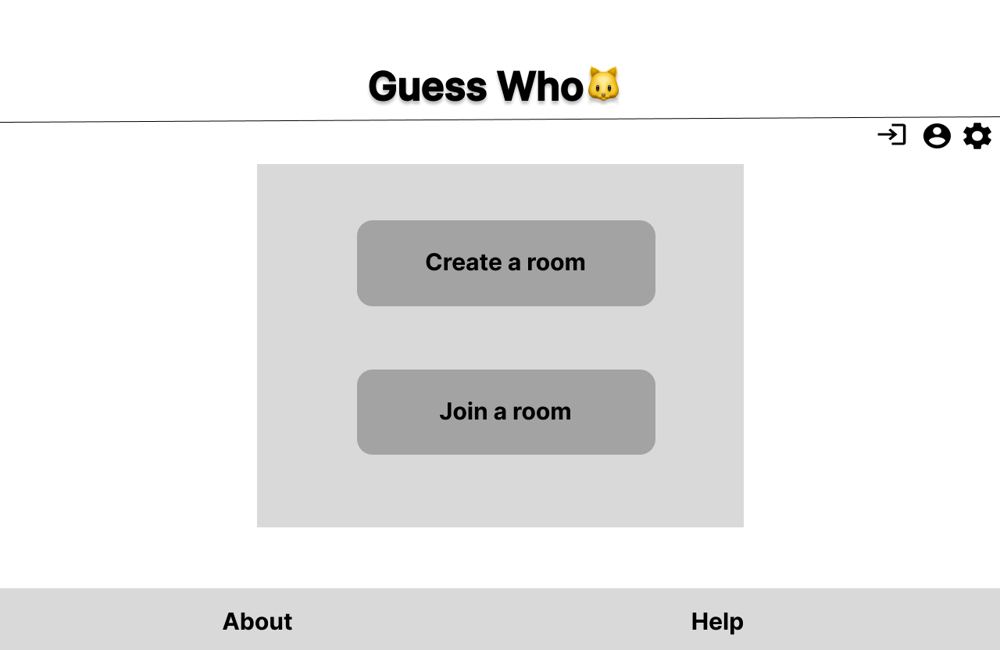
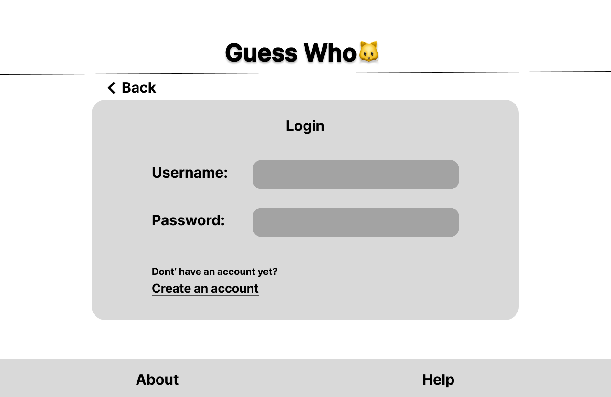
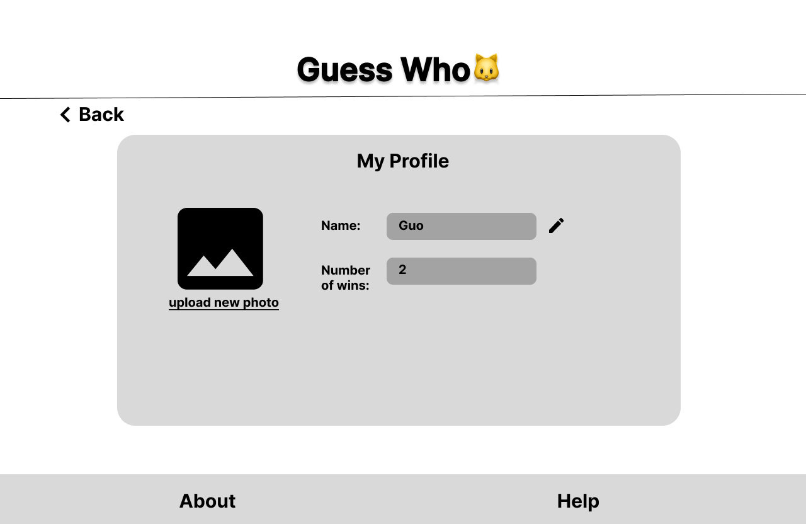
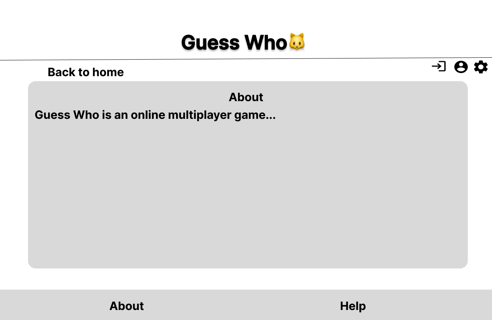
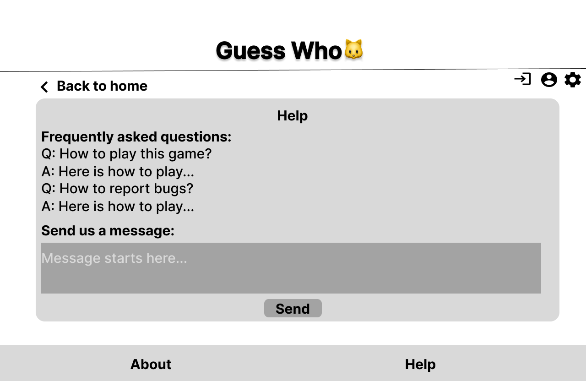
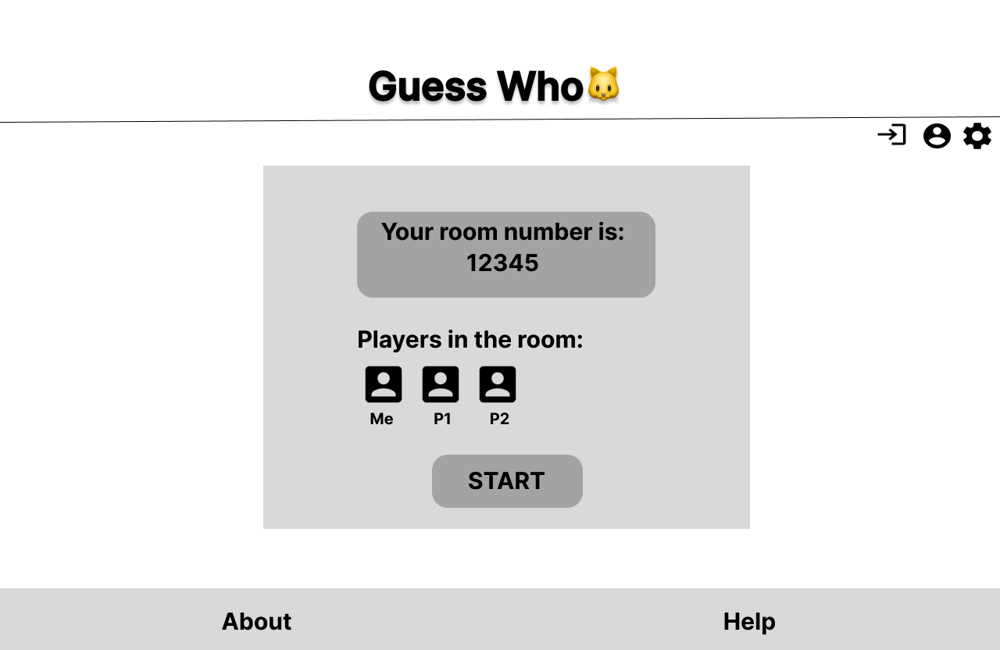
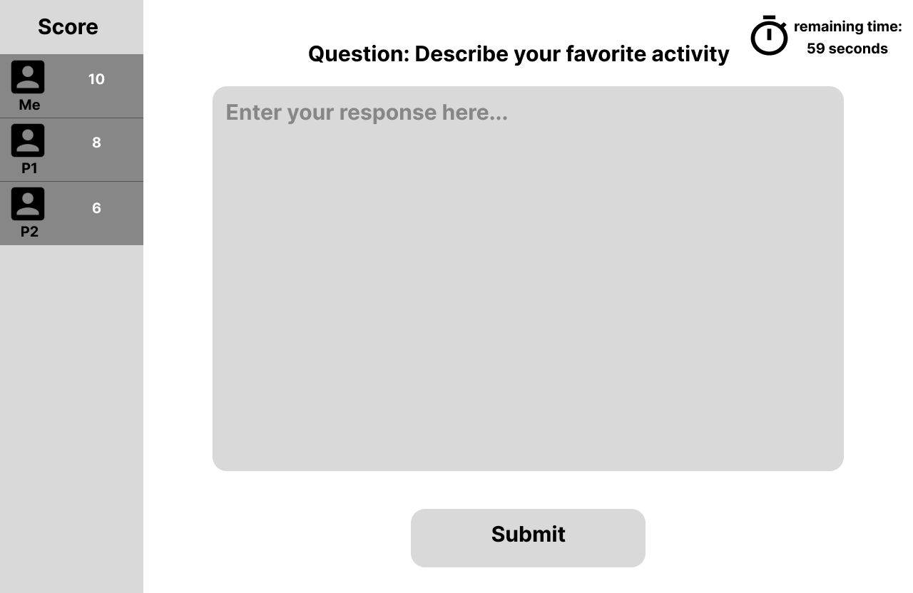
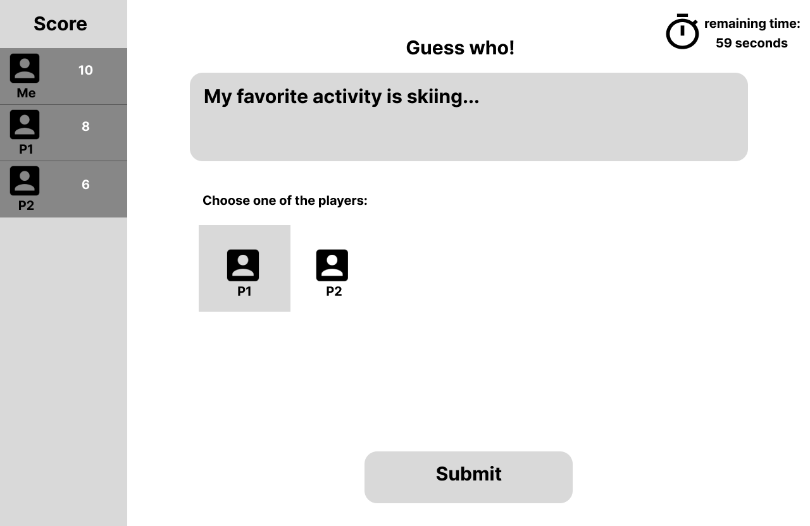
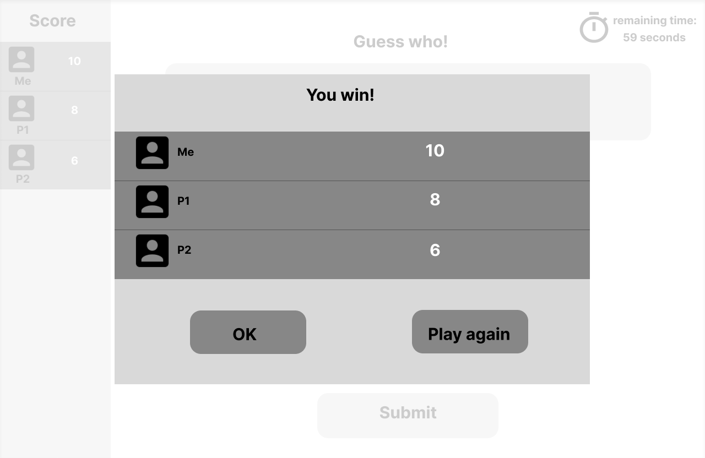
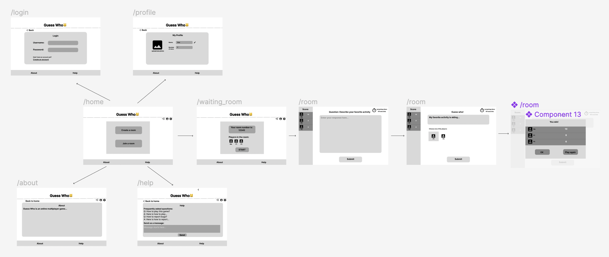

# Guess Who 

## Overview

This project is an online multiplayer game suitable for party. A group of players will be prompted with questions about themselves. Their answers will then be gathered and displayed back on the screen for others to guess. Those successfully figure out the writer will score, and after several rounds, the player with the highest score wins!

## Data Model

The application will store Questions and Users. 
* questions will have one field "content"
* users will have fields "username", "hash", "wins"(maybe "friends"--a list of ObjectIds of other Users)

An Example Question: 

```javascript
{
  content: "How old are you"
}
```

An Example User:

```javascript
{
  username: "Guo",
  hash: // a password hash,
  wins: //number of wins,
}
```

## [Link to Commented First Draft Schema](db.mjs) 

## Wireframes

/home - home page


/login - page for login


/profile - page for user profile


/about - page for About


/help - page for Help


/waitingroom - page when user is waiting


/room - pages for different stages of a game




## Site map


## User Stories or Use Cases
1. as non-registered user, I can register a new account with the site
2. as a user, I can log in and view my profile
3. as a user, I can create a game room and invite friends
4. as a user, I can play the guessing game in real time with my friends and view my scores
5. as a user, I can get help or contact the developer

## Research Topics
* (6 points) React.js
  * I'm going to use React.js as my frontend framework
* (3 points) Unit testing
  * I'm going to conduct unit testing with Mocha
9 points total out of 8 required points
## [Link to Initial Main Project File](app.mjs) 

## Annotations / References Used

(__TODO__: list any tutorials/references/etc. that you've based your code off of)


